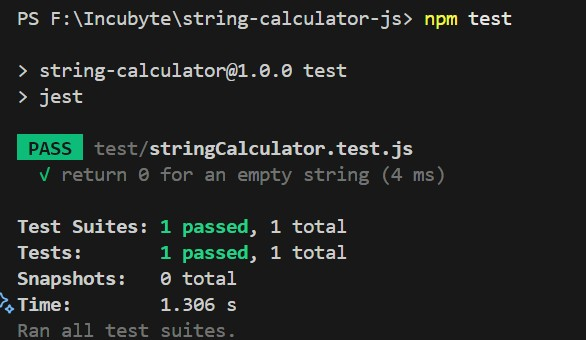
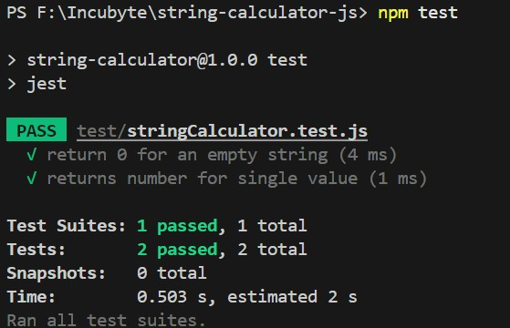
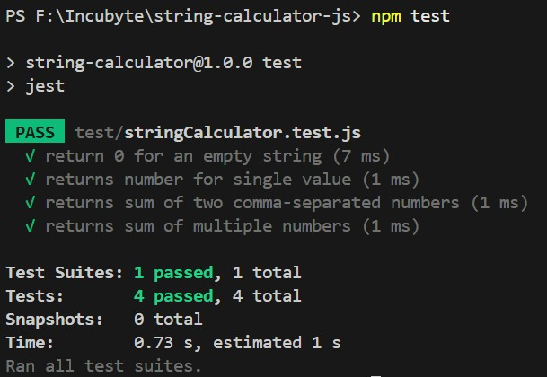
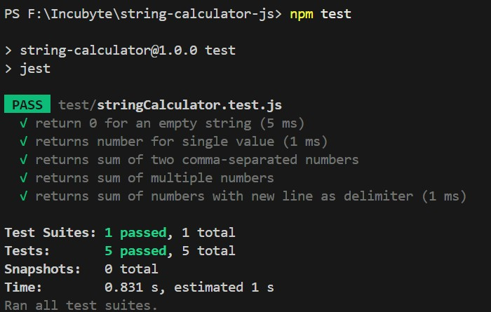
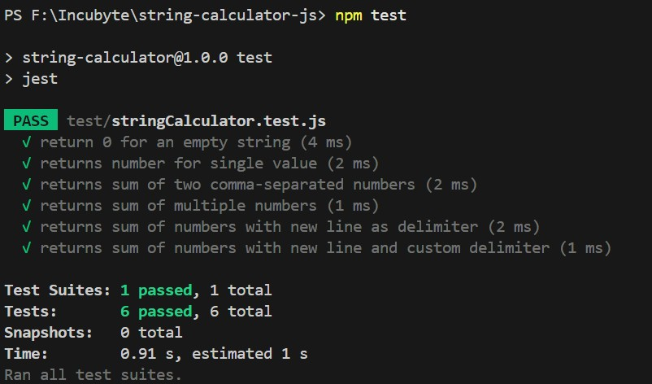
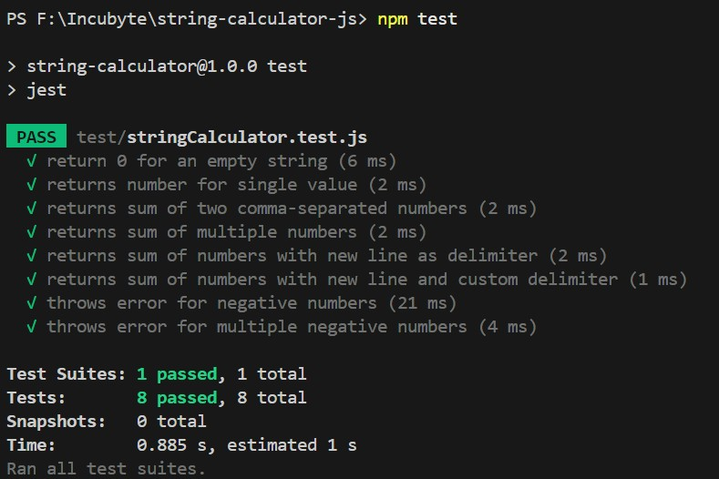
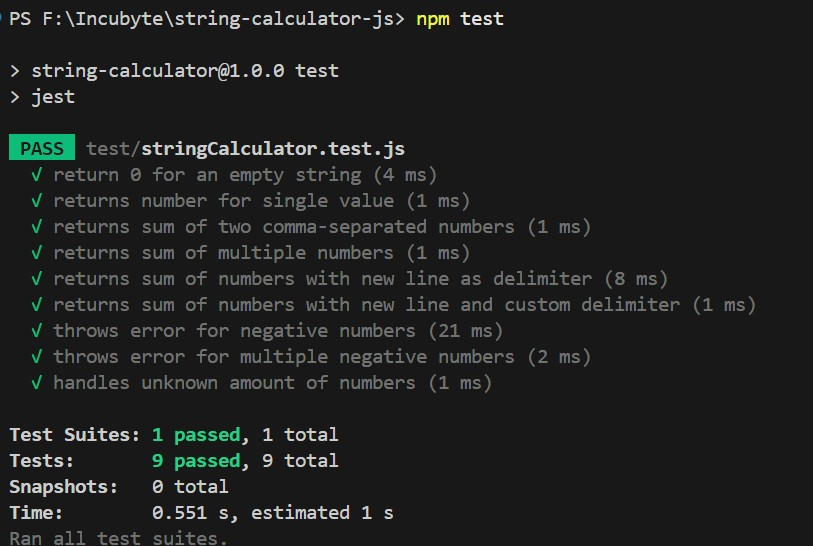
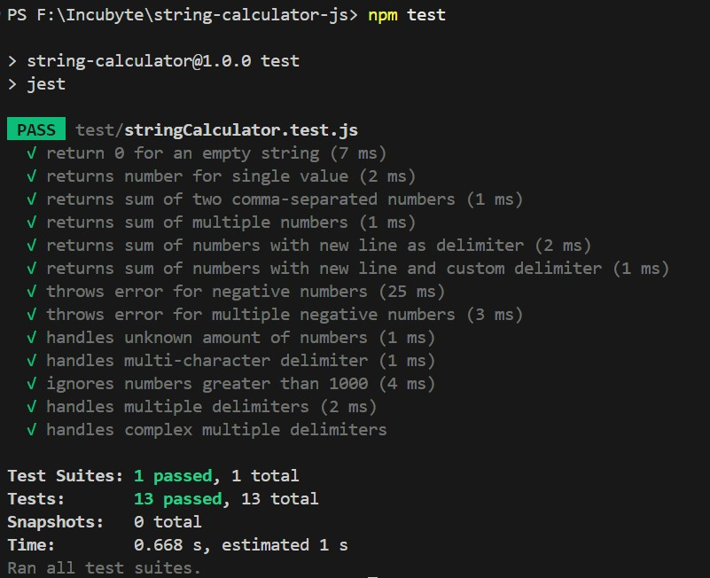

# String Calculator - TDD Implementation

## Overview
This repository contains a string calculator implementation developed using Test-Driven Development (TDD) principles. The calculator supports various input formats and delimiters while handling edge cases like negative numbers and large values.

## Technology Stack

- **Runtime**: Node.js
- **Testing Framework**: Jest
- **Package Manager**: npm
- **Language**: JavaScript
- **TDD Methodology**: Full test coverage with iterative development

## Features

- ✅ Handles empty strings by returning 0  
- ✅ Supports comma (`,`) and newline (`\n`) as default delimiters  
- ✅ Allows custom single or multiple delimiters (including multi-character ones)  
- ✅ Ignores numbers greater than 1000  
- ✅ Throws errors for negative numbers with detailed message 

## Setup

1. **Clone the repository**:
   ```bash
   git clone https://github.com/Naittik25/Incubyte-TDD-Assessment.git
   cd string-calculator

2. Install dependencies:  npm install

3. Testing
   Run the test suite with:  npm test

# Test Coverage
The test suite includes:

Empty string handling
Single and multiple number inputs
Various delimiter combinations
Negative number validation
Large number filtering

# Development

This project follows TDD principles with tests written in Jest.
The implementation supports:
Multiple delimiters of varying length
Type safety with number conversion
Comprehensive input validation

## 📷 Test Screenshots

### Empty string returns 0


### Single number input


### Two & Multiple comma-separated numbers


### Newline as delimiter


### Custom delimiter support


### Single & Multiple Nagative numbers


### Unknown amount of number


### Ignore Number>1000 & Multi-character & delimeter


